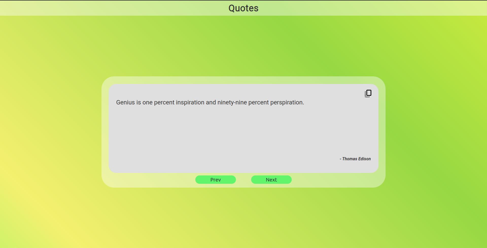

# Quote Machine

A simple front-end project for that includes showing some quotes to the users loaded from a JSON file. Building the JSON into the JS is a bad idea as it bloats the bundle, but it was a just to learn and experiment.

## How to run

First of all, clone the repository by downloading it or using git command line interface.

```bash
git clone https://github.com/abhisarshukla/QuoteMachine.git
```

After that `cd` into the directory and run:

```bash
npm install
```

Then to run a development server with [HMR](https://webpack.js.org/guides/hot-module-replacement/)(Hot Module Replacement) using [react-fast-refresh](https://github.com/pmmmwh/react-refresh-webpack-plugin) run the following command:

```bash
npm start
```

If you want to get production code then run the following:

```bash
npm run build
```

## What it looks like

Maybe not the best UI design for this, but here it is:

